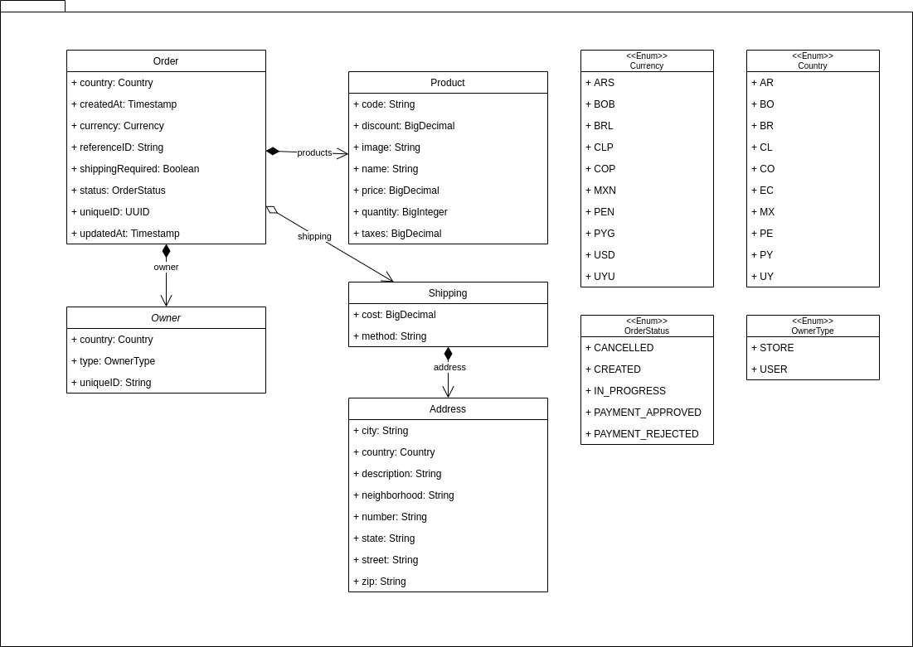
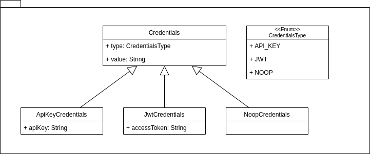
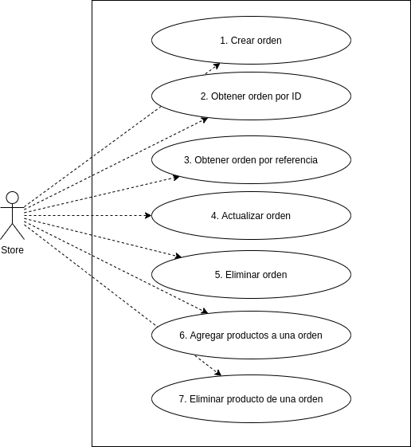

# ca-orders-ms

Este proyecto es un ejemplo de un web-service implementado siguiendo los lineamientos establecidos por Robert C. Martin
en su artículo [The Clean Architecture](https://blog.cleancoder.com/uncle-bob/2012/08/13/the-clean-architecture.html),
con el objetivo de ser utilizado como punto de referencia para adoptar esta metodología.

# Nuestro modelo de negocios

El dominio de nuestro ejemplo corresponde a un sistema que permite registrar y manipular órdenes o carritos de compras,
con las siguientes restricciones:

- No mantendremos inventario de productos
- Debemos implementar un mecanismo de autenticación para todas las acciones
- Debemos notificar eventos para todas las acciones

## Órdenes o carritos de compras

Vamos a definir un simple modelo de negocios en el cual representamos órdenes o carritos de compras, con un listado de
productos asociado y opcionalmente datos de envío.



## Autenticación

Adicionalmente vamos a definir el modelado de un simple esquema de autenticación, en el que definimos diferentes tipos
de credenciales con las cuales un usuario puede autenticarse con nuestro servicio. El objetivo de estas credenciales es
poder autenticar e identificar de forma unívoca al usuario o tienda que hace uso de nuestro servicio.



## Casos de uso

Finalmente definimos una lista con siete casos de uso báscios que debe implementar nuestra aplicación.



# Tecnologías empleadas

Para el desarrollo del ejemplo se utilizaron las siguientes tecnologías y frameworks.

- Java JDK 11 - Java y Kotlin como lenguajes
- [Spring Boot](https://spring.io/projects/spring-boot)
- [Gradle](https://gradle.org/)
- [Docker Compose](https://docs.docker.com/compose/)
- [Apache Kafka](https://kafka.apache.org/)
- [Apache Cassandra](https://cassandra.apache.org/_/index.html)
- [PostgreSQL](https://www.postgresql.org/)
- [MySQL](https://www.mysql.com/)
- [MongoDB](https://www.mongodb.com/es)
- [Redis](https://redis.io/)

## Corriendo servicios con docker-compose

En la raíz del proyecto se encuentra el archivo `docker-compose.yml` con los servicios utilizados por los diferentes
adapters desarrollados en este proyecto:

```bash
$ docker-compose -f docker-compose.yml up -d

Starting mongo     ... done     
Starting mysql     ... done
Starting kafka     ... done
Starting redis     ... done
Starting postgres  ... done
Starting cassandra ... done
```

# Estructura del proyecto

## ca-orders-domain

Contiene las clases de dominio correspondientes al modelo de órdenes y autenticación. Son simples clases y enumeraciones
en lenguaje Java.

## ca-orders-use-case

Contiene las interfaces y clases que modelan e implementan los casos de uso, junto con las interfaces o ports a los
componentes de menor nivel.

## ca-spring-application

Este sub-proyecto es el que junta todas las piezas, generando una aplicación ejecutable. La forma en que se pueden
itercambiar las diferentes implementaciones, es a través del archivo `build.gradle`, en el cual definimos las
dependencias:

```groovy
// ca-spring-application/build.gradle

dependencies {
    implementation(
        project(":ca-orders-domain"),
        project(":ca-orders-use-case"),
        platform("org.springframework.boot:spring-boot-dependencies:2.5.4"),
        "org.jetbrains.kotlin:kotlin-reflect",
        "org.springframework.boot:spring-boot-starter-web"
    )

    implementation(
        project(":ca-spring-dummy-adapter")
    )

    // Un-comment this block for Cassandra persistence implementation
    // implementation(
    //     project(":ca-spring-cassandra-adapter"),
    //     "org.springframework.boot:spring-boot-starter-data-cassandra"
    // )

    // Un-comment this block for JPA persistence implementation
    // implementation(
    //     project(":ca-spring-jpa-adapter"),
    //     "org.flywaydb:flyway-core",
    //     "org.springframework.boot:spring-boot-starter-data-jpa"
    // )
    //
    // runtimeOnly(
    //     "com.h2database:h2",
    //     "mysql:mysql-connector-java",
    //     "org.postgresql:postgresql"
    // )

    // Un-comment this block for Kafka event sending implementation
    // implementation(
    //     project(":ca-spring-kafka-adapter"),
    //     "org.springframework.kafka:spring-kafka"
    // )

    // Un-comment this block for MongoDB persistence implementation
    // implementation(
    //     project(":ca-spring-mongo-adapter"),
    //     "org.springframework.boot:spring-boot-starter-data-mongodb"
    // )

    // Un-comment this block for Redis persistence implementation
    // implementation(
    //     project(":ca-spring-redis-adapter"),
    //     "org.springframework.boot:spring-boot-starter-data-redis"
    // )
}
```

## ca-spring-dummy-adapter

Provee implementaciones muy simples de los ports definidos en `ca-orders-use-case`, para ser utilizadas como fallback.

## ca-spring-cassandra-adapter

Provee implementaciones para los ports de tipo `Repository`, con Apache Cassandra como base de datos para persistencia.

Requisitos:

- Correr el servicio `cassandra` con docker-compose
- Descomentar el bloque correspondiente en el archivo `ca-spring-application/build.gradle`
- Setear variables de entorno

**docker-compose**

```bash
$ docker-compose -f docker-compose.yml up -d cassandra
```

**build.gradle**

```groovy
dependencies {
    // ...
    implementation(
        project(":ca-spring-cassandra-adapter"),
        "org.springframework.boot:spring-boot-starter-data-cassandra"
    )
    // ...
}
```

**Variables de entorno**

```
CASSANDRA_CONTACT_POINTS=localhost:9042
```

## ca-spring-jpa-adapter

Provee implementaciones para los ports de tipo `Repository`, utilizando JPA como mecanismo para delegar la persistencia
de datos.

### H2 in-memory database

Requisitos:

- Descomentar el bloque correspondiente en el archivo `ca-spring-application/build.gradle`
- Setear variables de entorno

**build.gradle**

```groovy
// ca-spring-application/build.gradle

dependencies {
    // ...
    implementation(
        project(":ca-spring-jpa-adapter"),
        "org.flywaydb:flyway-core",
        "org.springframework.boot:spring-boot-starter-data-jpa"
    )

    runtimeOnly(
        "com.h2database:h2"
    )
    // ...
}
```

**Variables de entorno**

```
DATABASE_JDBC_URL=jdbc:h2:mem:testdb
DATABASE_JDBC_USERNAME=sa
DATABASE_JDBC_PASSWORD=
DATABASE_JDBC_DRIVER_CLASS_NAME=org.h2.Driver
DATABASE_VENDOR=h2
```

### MySQL

Requisitos:

- Correr el servicio `mysql` con docker-compose
- Desde el contenedor de Docker, dar privilegios al usuario `sa` para que pueda conectarse desde el host.
- Descomentar el bloque correspondiente en el archivo `ca-spring-application/build.gradle`
- Setear variables de entorno

**docker-compose**

```bash
$ docker-compose -f docker-compose.yml up -d mysql
```

**Grant privileges**

Esto es necesario hacerlo una única vez, y es para permitirle al usuario `sa` poder conectarse al MySQL corriendo en el
contenedor, desde cualquier host.

```
#  mysql -h localhost -u root -p

mysql> GRANT ALL PRIVILEGES ON * . * TO 'sa'@'%';
Query OK, 0 rows affected (0.01 sec)

mysql> FLUSH PRIVILEGES;
Query OK, 0 rows affected (0.01 sec)
```

**build.gradle**

```groovy
// ca-spring-application/build.gradle

dependencies {
    // ...
    implementation(
        project(":ca-spring-jpa-adapter"),
        "org.flywaydb:flyway-core",
        "org.springframework.boot:spring-boot-starter-data-jpa"
    )

    runtimeOnly(
        "mysql:mysql-connector-java"
    )
    // ...
}
```

**Variables de entorno**

```
DATABASE_JDBC_URL=jdbc:mysql://localhost:3306/localmysqldb
DATABASE_JDBC_USERNAME=sa
DATABASE_JDBC_PASSWORD=secret
DATABASE_JDBC_DRIVER_CLASS_NAME=com.mysql.jdbc.Driver
DATABASE_VENDOR=mysql
```

### PostgreSQL

Requisitos:

- Correr el servicio `postgres` con docker-compose
- Descomentar el bloque correspondiente en el archivo `ca-spring-application/build.gradle`
- Setear variables de entorno

**docker-compose**

```bash
$ docker-compose -f docker-compose.yml up -d postgres
```

**build.gradle**

```groovy
// ca-spring-application/build.gradle

dependencies {
    // ...
    implementation(
        project(":ca-spring-jpa-adapter"),
        "org.flywaydb:flyway-core",
        "org.springframework.boot:spring-boot-starter-data-jpa"
    )

    runtimeOnly(
        "org.postgresql:postgresql"
    )
    // ...
}
```

**Variables de entorno**

```
DATABASE_JDBC_URL=jdbc:postgresql://localhost:5432/localpostgresdb
DATABASE_JDBC_USERNAME=sa
DATABASE_JDBC_PASSWORD=secret
DATABASE_JDBC_DRIVER_CLASS_NAME=org.postgresql.Driver
DATABASE_VENDOR=postgresql
```

## ca-spring-mongo-adapter

Provee implementaciones para los ports de tipo `Repository`, con MongoDB como base de datos para persistencia.

Requisitos:

- Correr el servicio `mongo` con docker-compose
- Descomentar el bloque correspondiente en el archivo `ca-spring-application/build.gradle`
- Setear variables de entorno

**docker-compose**

```bash
$ docker-compose -f docker-compose.yml up -d mongo
```

**build.gradle**

```groovy
// ca-spring-application/build.gradle

dependencies {
    // ...
    implementation(
        project(":ca-spring-mongo-adapter"),
        "org.springframework.boot:spring-boot-starter-data-mongodb"
    )
    // ...
}
```

**Variables de entorno**

```
MONGO_DATABASE_URL=mongodb://localhost:27017/localmongodb
```

## ca-spring-redis-adapter

Provee implementaciones para los ports de tipo `Repository`, con Redis como base de datos para persistencia.

Requisitos:

- Correr el servicio `redis` con docker-compose
- Descomentar el bloque correspondiente en el archivo `ca-spring-application/build.gradle`
- Setear variables de entorno

**docker-compose**

```bash
$ docker-compose -f docker-compose.yml up -d redis
```

**build.gradle**

```groovy
// ca-spring-application/build.gradle

dependencies {
    // ...
    implementation(
        project(":ca-spring-redis-adapter"),
        "org.springframework.boot:spring-boot-starter-data-redis"
    )
    // ...
}
```

**Variables de entorno**

```
REDIS_HOST=localhost
REDIS_PORT=6379
```

## ca-spring-kafka-adapter

Provee implementaciones para los ports de tipo `Sender`, con Kafka como broker de mensajes.

Requisitos:

- Correr el servicio `kafka` con docker-compose
- Desde el contenedor de Docker, crear los tópicos para el envío de mensajes
- Descomentar el bloque correspondiente en el archivo `ca-spring-application/build.gradle`
- Setear variables de entorno

**docker-compose**

```bash
$ docker-compose -f docker-compose.yml up -d redis
```

**Creación de tópicos**

Esta acción es necesaria una única vez, y consiste en crear los tres tópicos necesarios para notificar eventos de tipo
CREATED, UPDATED y DELETED de las órdenes.

```bash
$ ${KAFKA_HOME}/bin/kafka-topics.sh --create \
--zookeeper localhost:2181 \
--topic kafka_created_order_topic \
--partitions 3 \
--replication-factor 1

$ ${KAFKA_HOME}/bin/kafka-topics.sh --create \
--zookeeper localhost:2181 \
--topic kafka_deleted_order_topic \
--partitions 3 \
--replication-factor 1

$ ${KAFKA_HOME}/bin/kafka-topics.sh --create \
--zookeeper localhost:2181 \
--topic kafka_updated_order_topic \
--partitions 3 \
--replication-factor 1
```

**build.gradle**

```groovy
// ca-spring-application/build.gradle

dependencies {
    // ...
    implementation(
        project(":ca-spring-kafka-adapter"),
        "org.springframework.kafka:spring-kafka"
    )
    // ...
}
```

**Variables de entorno**
```
KAFKA_BOOTSTRAP_SERVERS=localhost:9092
```

# Crear una versión ejecutable de la aplicación

Una vez configurados los adapters que se deseen utilizar, es posible crear un `.jar` ejecutable con Gradle:

```bash
$ ./gradlew clean build
```

Y luego ejecutar el `.jar` generado:

```
$ java -jar ca-spring-application/build/libs/ca-spring-application-boot.jar
```

# Postman collection

Dentro de la carpeta `static/collection` se encuentra una colección de [Postman](https://www.postman.com/) para importar
y probar el servicio.
